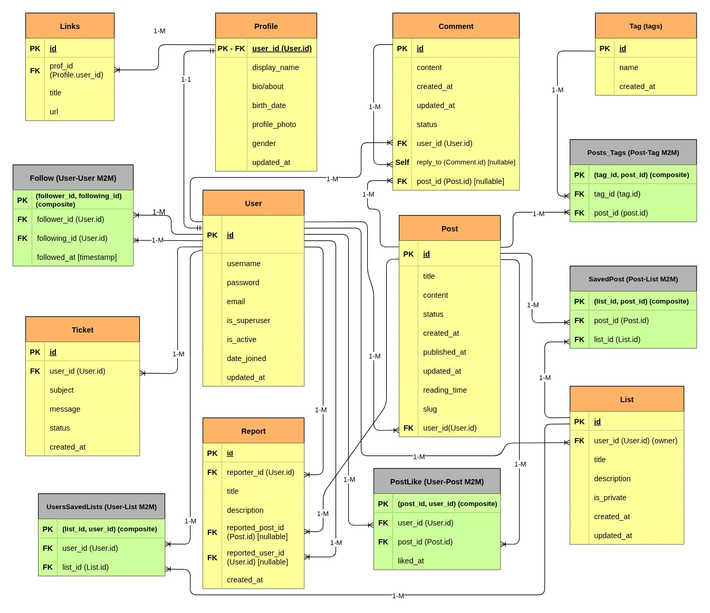

# Blog API - FastAPI

A RESTful API using FastAPI, SqlAlchemy, Postgresql, Redis, Pytest, etc.<br>
**NOTE:** project is developing and explanations is not completed yet. the README will be completed more and more along with adding new features!

## Features
- Asynchronous routing and crud operations (check at: [routes/](./src/routes/) - [crud/](./src/crud/) - [services/](./src/services/))
- Authentication (JWT), Authorization and different permission levels (check at: [auth/](./src/auth/) - [services/authentication.py](./src/services/authentication.py) - `[routes/](./src/routes/) - [routes/admin/](./src/routes/admin/))
- Revoking (blacklisting) used but unexpired tokens until they expire (using **Redis**) (check at: [auth/token_revocation.py](./src/auth/token_revocation.py) - [services/authentication.py](./src/services/authentication.py))
- Custom exceptions and custom exception handling (check at: [core/exception.py](./src/core/exceptions.py) - [utils/exception_handler.py](./src/utils/exception_handlers.py) - [main.py](./src/main.py))
- ...
- etc... (just explore project's [source code](./src/) and discover other features!)

<br>

## Project Structure
```bash
├── docs
├── src
│   ├── auth/                       # JWT Authentication Logic (+ TokenRevocation)
│   │
│   ├── core/                       # Configurations and Core Utils (db & redis setup,
│   │                               # settings, custom-exception, middlewares, etc.)
│   │
│   ├── crud/                       # Database Raw CRUD Logic (NO business logic)
│   ├── migrations/                 # Database Table's Migrations (managed by alembic)
│   ├── models/                     # SQLAlchemy Models (User, Post, Tag, Comment, etc.)
│   ├── routes/                     # API Endpoints
│   ├── schemas/                    # Pydantic Models for API Endpoints
│   ├── services/                   # Layer Between CRUD & Routes (includes business logic)
│   ├── tests/
│   ├── utils/
│   │   ├── dependencies.py         # Endpoint's Dependencies (db, redis, current-user & admin)
│   │   ├── exception_handler.py    # Custom Handler for Custom Exceptions
│   │   └── utils.py                # ...
│   │
│   └── main.py                     # FastAPI Entry Point
│
├── .env.example                    # ...
├── .gitignore
├── alembic.ini                     # ...
├── LICENSE
├── README.md
└── requirements.txt
```

<br>

## Work Cycle
...

<br>

## Project's Database Entity Relationship
<p align="center">
  
</p>

- ...

<br>

## Setup and Test

- ...

<br>


## License

This project is licensed under the MIT License. See the [LICENSE](./LICENSE) file for more details.

<br>

---

**Developed by [hamidgh01](https://github.com/hamidgh01)**
